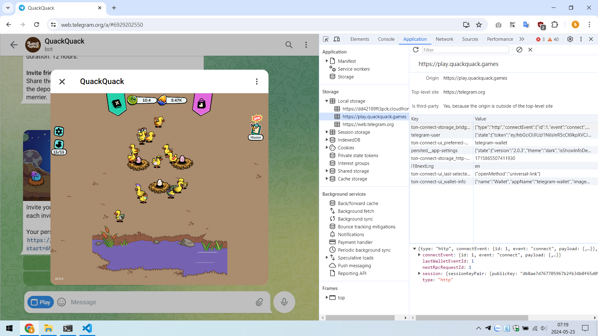
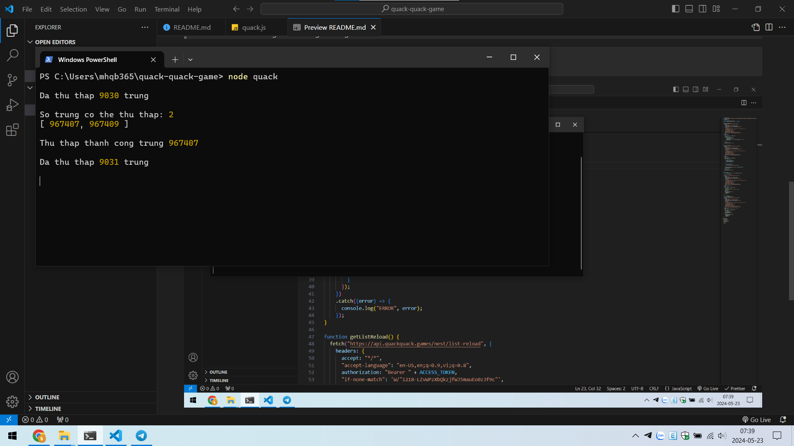

#  Tự động nhặt trứng Quack Quack game

> Bạn phải có NodeJS trên máy tính > https://nodejs.org

> Bạn phải mở song song cửa sổ Quack Quack và Terminal để công cụ thu thập trứng chạy ổn định nhé

## Bước 1: Lấy ACCESS_TOKEN của mình và bỏ vào quack.js

> Dùng Tele Web, mở game Quack Quack lên rồi mở Devtools > Application > Local storage > play.quackquack.games > telegram-user.state.token



## Bước 2: Khởi chạy

> Bước 2: Mở Terminal trong folder mã nguồn rồi gõ vào:

```sh
node quack
```



> From https://mhqb365.com with ♥