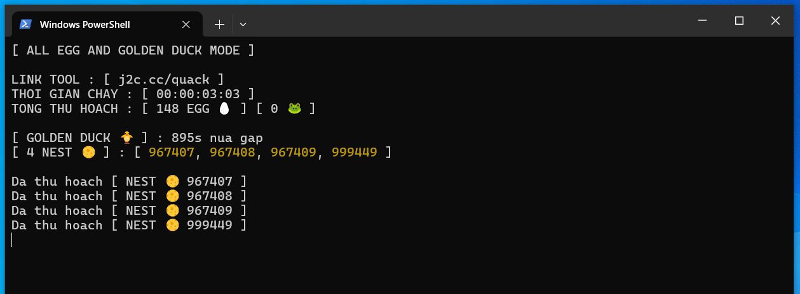
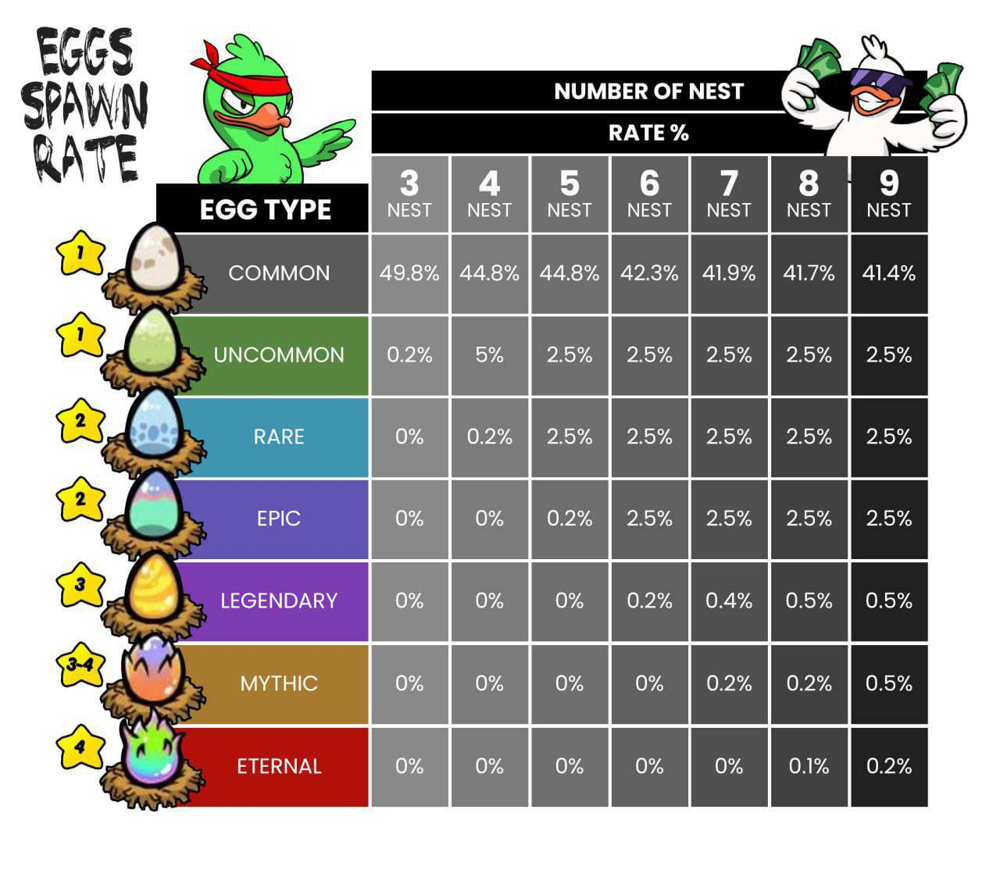
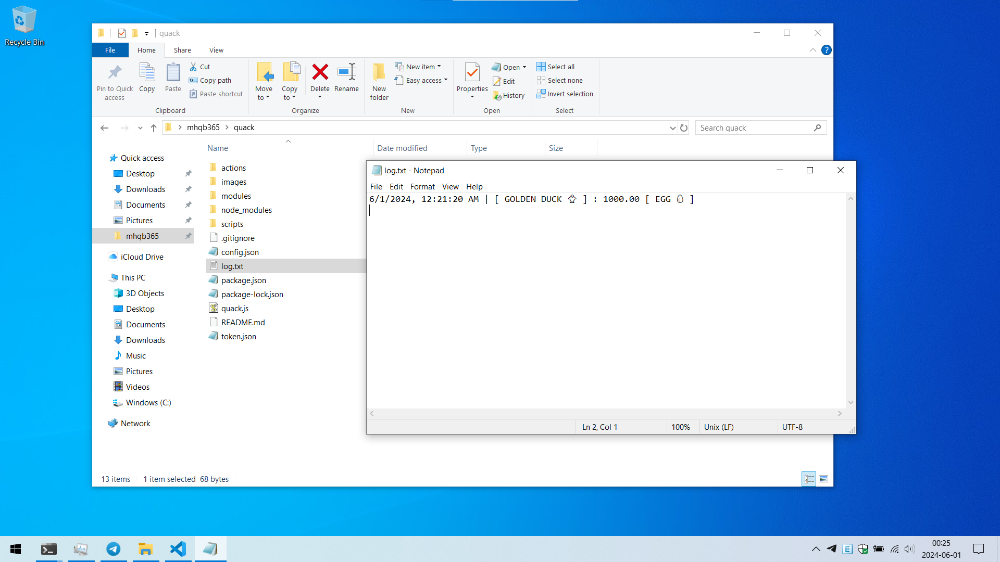

# Quack Quack Game Tool



> Đây công cụ tui làm ra chỉ để thử sức code nên nó rất đơn giản. Công việc của tui là Sửa Laptop chứ không phải Dev mấy má ưi 😍

> Windows / Mac / Linux đều dùng được miễn có cài NodeJS. Link tải đây https://nodejs.org/en/download/prebuilt-installer

> Mọi người có hứng thú với con game vô tri này thì đăng ký qua link ủng hộ tui nhé https://t.me/quackquack_game_bot?start=6hn8Xrp7DK

> Link Tool https://j2c.cc/quack

## Tuyên bố miễn trừ trách nhiệm

> Tui (mhqb365) là chủ sở hữu của những đoạn code trên, tuyên bố sẽ miễn trừ trách nhiệm khi bạn sử dụng những đoạn code này

> Bạn có quyền sử dụng nó tùy ý, tuy nhiên xin lưu ý rằng trong mọi trường hợp, khi bạn sử dụng những đoạn code trên cho những mục đích xấu, sửa đổi hoặc những việc tương tự nhằm mục đích gây hại cho những cá nhân, tổ chức khác, bạn sẽ phải chịu trách nhiệm cho những việc đó. Tôi sẽ không phải chịu bất cứ trách nhiệm gì từ việc này

> Chúc bạn sử dụng Tool vui vẻ

## Tính năng

> Chạy hoàn toàn độc lập, không bị ảnh hưởng khi mở game

> Tự động lụm trứng

> Tự động lụm ZỊT ZÀNG (cái con bạch tuột mỏ vịt xuất hiện mỗi 30 phút, vì lý do bảo mật nên không claim được TON nhé)

> Tự động ấp trứng xịn để tìm vịt xịn

> Tùy chọn chức năng để chạy Tool

## Tiêu chí ấp trứng tìm vịt xịn

> Khi chạy chức năng ấp trứng thì Tool sẽ tự chọn trứng có rate thấp (trứng hiếm) để ấp, dựa vào bảng độ hiếm



> Khi ấp ra vịt thì dựa vào các thành phần vịt để tính điểm


- COMMON : 1 điểm
- RARE : 2 điểm
- LEGENDARY : 3 điểm

> Nếu vịt có tổng điểm cao hơn thì xịn hơn

> Tool sẽ tự động chọn ra vịt lỏ để xóa đi khi FARM vịt đầy

## Cách dùng

> Cài NodeJS chưa? Chưa thì kéo lên trên lấy link tải về cài vào

> Tải Tool về, thấy cái nút (<> Code) màu xanh lá ở trên hem? Bấm vào đó để Download ZIP về, giải nén rồi mở folder vừa giải nén ra

> Máy tính cần hiện đuôi file để thao tác dễ hơn. Hiện đuôi file bằng cách Start menu (bấm phím Windows) > File Explorer options > View > bỏ tick Hide extentions for known file types > OK


> Copy Token game, xem cách lấy Token qua hình dưới đây


> Paste Token vừa copy vào file ```token.json``` rồi lưu lại. Nếu chưa có thì tạo file mới (Chuột phải > New > Text Document > token.json)


> Cài đặt Tool ở file ```config.json```, giữ nguyên hoặc xem chú thích bên dưới để cài đặt

```json
{
  "nest": 3, // số TỔ vịt bạn đang có, nếu bạn có nhiều hơn thì thay số vào (cái tổ|ổ chứ không phải số con vịt nhen mấy má)
  "sleepTime": 1, // thời gian nghỉ giữa mỗi lần lụm trứng, đơn vị: s(second), số càng lớn thì càng chậm
  "retryCount": 5, // số lần thử lại khi mất kết nối, quá số lần sẽ dừng Tool
}
```

> Mở Terminal / PowerShell / Cmd trong folder Tool (đè Shift + chuột phải > Open PowerShell)

> Gõ vào lệnh ```npm install``` để cài đặt các thư viện cần thiết

## Tùy chọn tính năng chạy Tool

> Gõ vào Terminal / PowerShell / Cmd lệnh ```node quack``` để chạy chức năng Lụm tất cả trứng & lụm ZỊT ZÀNG

> Hoặc gõ vào lệnh ```node quack 1``` để chạy chức năng Không lụm trứng mà chỉ lụm ZỊT ZÀNG

> Hoặc gõ vào lệnh ```node quack 2``` để chạy chức năng Lụm trứng lỏ, ấp trứng xịn & lụm ZỊT ZÀNG


## Phần phụ

> Xem lại lịch sử lụm ZỊT ZÀNG, ấp vịt xịn ở file ```log.txt```



From https://mhqb365.com with Love ♥ and GoodLuck
