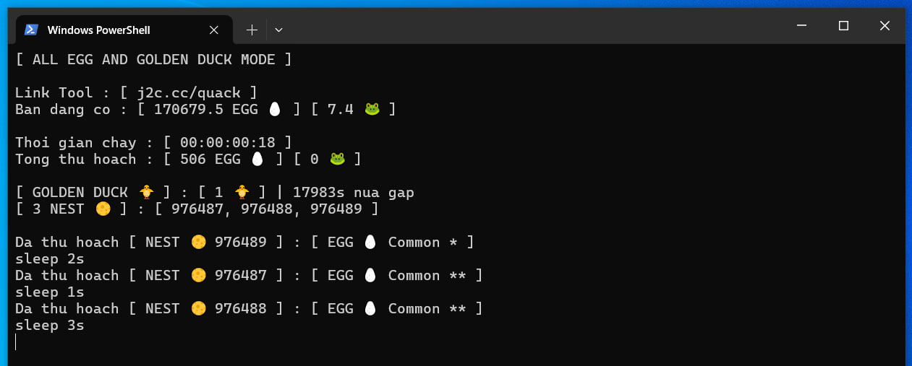
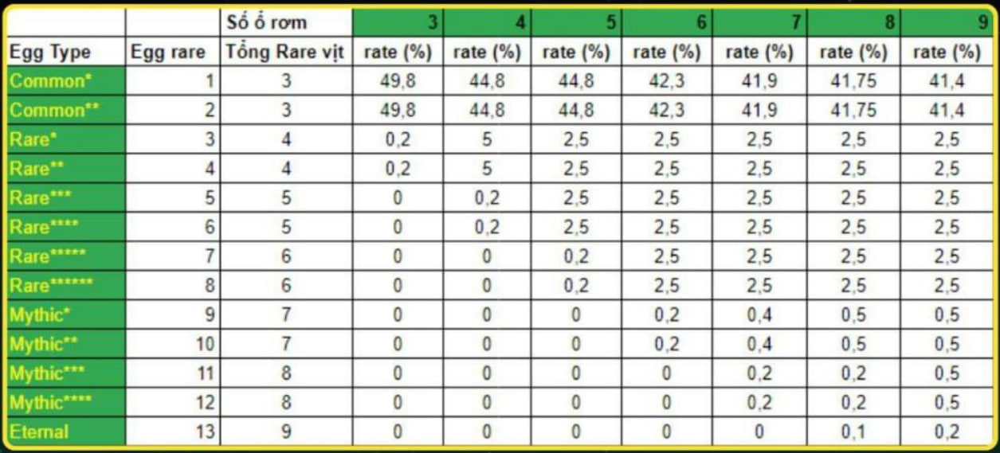
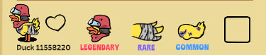
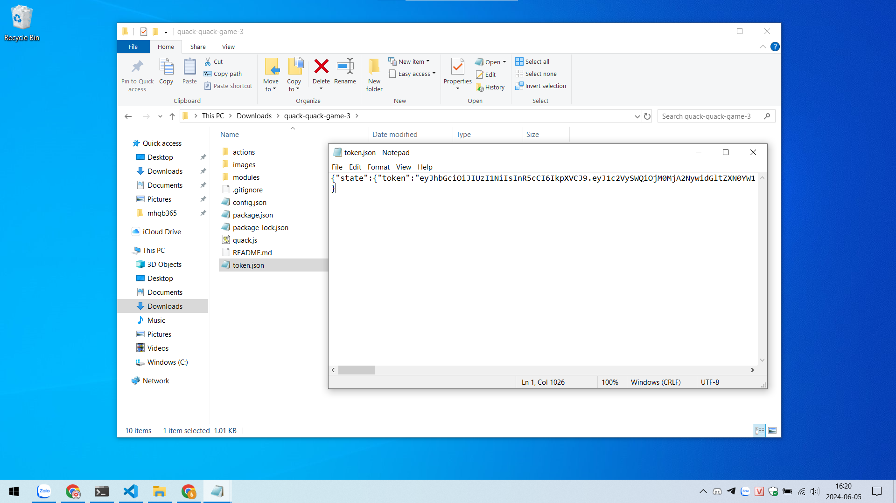
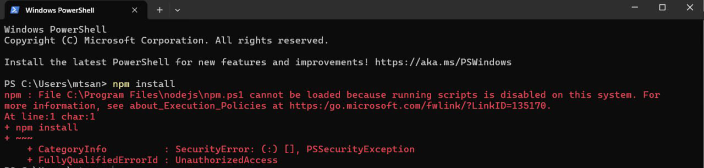
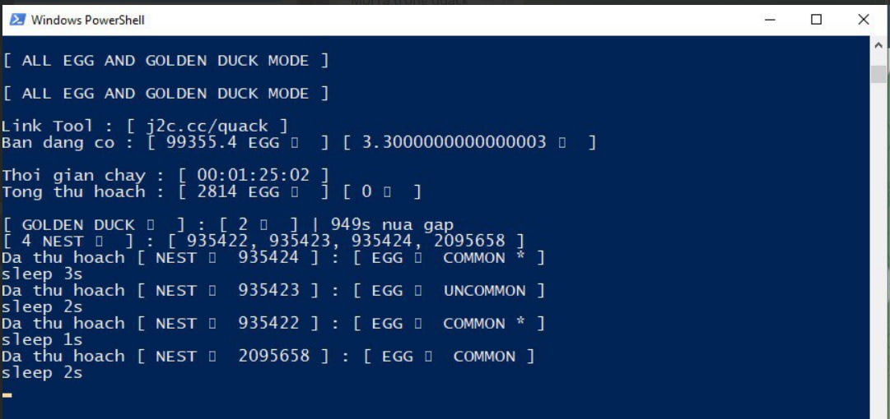

# Quack Quack Game Tool



> Đây công cụ tui làm ra chỉ để thử sức code nên nó rất đơn giản vì công việc của tui là sửa laptop chứ không phải làm về code mấy má ưi 😍

> Windows / Mac / Linux đều dùng được miễn có cài khứa này 👉 [NodeJS](https://nodejs.org/en/download/prebuilt-installer)

> Mọi người có hứng thú với con game vô tri này thì đây 👉 [Quack Quack Game](https://t.me/quackquack_game_bot?start=6hn8Xrp7DK)

> Link Tool 👉 [j2c.cc/quack](https://j2c.cc/quack)

## Tuyên bố miễn trừ trách nhiệm

> Tui (mhqb365) là chủ sở hữu của những đoạn code trên, tuyên bố sẽ miễn trừ trách nhiệm khi bạn sử dụng những đoạn code này

> Bạn có quyền sử dụng nó tùy ý, tuy nhiên xin lưu ý rằng trong mọi trường hợp, khi bạn sử dụng những đoạn code trên cho những mục đích xấu, sửa đổi hoặc những việc tương tự nhằm mục đích gây hại cho những cá nhân, tổ chức khác, bạn sẽ phải chịu trách nhiệm cho những việc đó. Tôi sẽ không phải chịu bất cứ trách nhiệm gì từ việc này

> Chúc bạn sử dụng Tool vui vẻ

## Tính năng

> Chạy hoàn toàn độc lập, không bị ảnh hưởng khi mở game

> Tự động lụm trứng

> Tự động lụm ZỊT ZÀNG (cái con bạch tuột mỏ vịt lâu lâu xuất hiện, vì lý do bảo mật nên không lụm được TON nhé)

> Tự động ấp trứng hiếm để tìm vịt xịn

> Tùy chọn chức năng để chạy Tool

> Ngẫu nhiên vị trí tổ rơm lụm trứng

> Ngẫu nhiên thời gian lụm trứng, từ 1 đến maxSleepTime trong file ```config.json```, đơn vị: giây

## Tiêu chí ấp trứng

> Khi chạy chức năng ấp trứng thì Tool sẽ tự chọn trứng hiếm để ấp (2 loại trứng có rate thấp nhất) theo bảng độ hiếm này



> Khi ấp ra vịt thì dựa vào các thành phần vịt để tính điểm



- LEGENDARY : 3 điểm
- RARE : 2 điểm
- COMMON : 1 điểm

> Vịt có tổng điểm cao hơn thì xịn hơn

> Ấp ra vịt lỏ tự động xóa luôn

> Khi chạy chức năng ấp trứng thì Tool sẽ tự động xóa đi 1 con vịt lỏ nhất để nhường chổ ấp trứng khi FARM đầy

> Nói chung cái tính năng ấp trứng này là hoàn toàn tự động, tiêu chí là tạo FARM toàn vịt xịn theo số tổ rơm mà bạn có

## Cách dùng

> Cài NodeJS chưa? Chưa thì kéo lên trên lấy link tải về cài vào

> Tải Tool về, thấy cái nút (<> Code) màu xanh lá ở trên hem? Bấm vào đó để Download ZIP về, giải nén rồi mở thư mục vừa giải nén ra

> Máy tính cần hiện đuôi file để thao tác dễ hơn

> Hiện đuôi file trên Windows bằng cách mở Start menu (bấm phím Windows) > File Explorer Options > View > bỏ tick Hide extentions for known file types > OK


> Copy Token game, xem cách lấy Token qua hình dưới đây


> Paste Token vừa copy vào file ```token.json``` rồi lưu lại. Nếu chưa có thì tạo file mới (Chuột phải > New > Text Document > token.json)



> Cài đặt Tool ở file ```config.json```, giữ nguyên hoặc xem chú thích bên dưới để tùy chỉnh

```json
{
  "nest": 3, // số tổ rơm bạn đang có, nếu có nhiều hơn thì thay số vào
  "maxSleepTime": 3, // thời gian nghỉ tối đa giữa mỗi lần lụm trứng, đơn vị: giây
  "retryCount": 86400, // số lần thử lại khi mất kết nối, quá số lần sẽ dừng Tool
}
```

> Mở Terminal / PowerShell / Cmd trong thư mục Tool (trên Windows thì đè Shift + chuột phải > Open PowerShell window here)

> Gõ vào lệnh ```npm install``` để cài đặt các thư viện cần thiết

## Tùy chọn tính năng chạy Tool

- Gõ vào Terminal / PowerShell / Cmd lệnh
```bash
node quack
```
> để chạy chức năng Lụm tất cả trứng & lụm ZỊT ZÀNG

- Hoặc gõ vào lệnh
```bash
node quack 1
```
> để chạy chức năng Không lụm trứng mà chỉ lụm ZỊT ZÀNG

- Hoặc gõ vào lệnh
```bash
node quack 2
```
> để chạy chức năng Lụm trứng lỏ, ấp trứng xịn & lụm ZỊT ZÀNG


## Video hướng dẫn

> [Windows](https://vt.tiktok.com/ZSYAonHXF/)

## Phần phụ

> Xem lại lịch sử trong thư mục ```logs```

> Lịch sử lụm ZỊT ZÀNG ở file ```golden_duck_log_ngày_tháng_năm.txt```

> Lịch sử ấp trứng ở file ```farm_log_ngày_tháng_năm.txt```

> Lịch sử lỗi ở file ```error_log_ngày_tháng_năm.txt```

> Lịch sử khác file ```log_ngày_tháng_năm.txt```

## Các lỗi thường gặp

1. SecurityError / UnauthorizedAccess



> Gặp lỗi trên chỉ cần dán dòng lệnh dưới đây vào rồi enter là được

```bash
Set-ExecutionPolicy -ExecutionPolicy RemoteSigned -Scope CurrentUser
```

2. Không hiển thị icon / emoji



> Cái này là do PowerShell / Cmd không hỗ trợ. Tải [Terminal](https://github.com/microsoft/terminal) về cài đặt rồi mở Tool bằng Terminal nhé

From [mhqb365.com](https://mhqb365.com) with Love ❤ and GoodLuck
